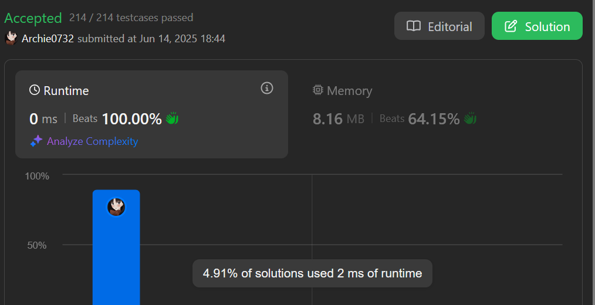

# 2566. Maximum Difference by Remapping a Digit


## 題目

給一個字串，有以下操作

- 選擇一個數字，將字串裡**所有選擇的字元**變為指定的數字

要求，回傳根據以上方法可以達到的 `最大值` - `最小值`

### 解題

- 把第一個數字變為`9`或`0` 則差值會最大
- 如果第一個數字為`9` -> 再去找第二個數字


### CODE (CPP)




```cpp
class Solution {
public:
    int minMaxDifference(int num) {
        
        string s = to_string(num);

        cout<<s<<endl;
        
        string res = "";
        char a = 'a', b = 'b';
        for(int i = 0; i < s.size(); i++){
            if(a == 'a' && s[i] != '9'){
                a = s[i];
            }
            if(b == 'b' && b != '0'){
                b = s[i];
            }

            char c = s[i];

            if(c == a && c == b){
                res += '9';
            }
            else if(c == a){
                int tem = '9' - c;
                res += to_string(tem);
            }
            else if(c == b){
                res += c;
            }
            else{
                res += '0';
            }
        }

        cout<<"res: "<<res<<endl;
        cout<<"a: "<<a<<", b: "<<b<<endl;

        int ans = 0;
        for(auto it : res){
            ans *= 10;
            ans+=it-'0';
        }

        return ans;

    }
};
```